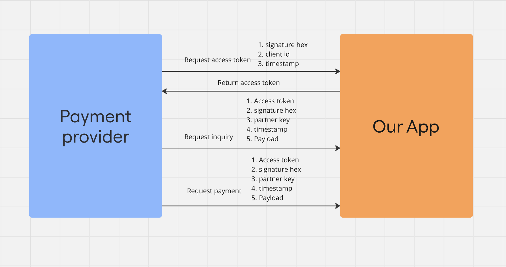

# SnapBI Example

This repository demonstrates how to generate a hash signature for the SnapBI API, a general specification for payment systems in Indonesia. The example showcases the implementation in a way that's compliant with SnapBI's requirements.

## Overview

SnapBI is a standard API specification for payments in Indonesia, facilitating integration between merchants and payment providers. To ensure data integrity and security, SnapBI requires that requests be signed using a SHA256 hash.

This project provides an example implementation for generating the required signature.

## Features

- Generate access token for usage in middleware
- Generate a hash signature as required by SnapBI.
- Lightweight and easy-to-follow example.

## Prerequisites

Before using this project, ensure you have the following installed:

- [Node.js](https://nodejs.org/) (v16 or later)
- [npm](https://www.npmjs.com/) or [yarn](https://yarnpkg.com/)
- [Postman](https://www.postman.com/)
- [bash](https://git-scm.com/downloads)

## Installation

1. Clone the repository:
   ```bash
   git clone https://github.com/akmalsyrf/snapbi-sha256-example.git
   ```

2. Navigate to the project directory:
   ```bash
   cd snapbi-sha256-example
   ```

3. Install the dependencies:
   ```bash
   npm install
   ```
   or
   ```bash
   yarn install
   ```

4. Run the script `asymmetric-keypair.sh` for generating key for secret JWT
   ```bash
   bash ./bin/asymmetric-keypair.sh
   ```

5. Import the postman collection & environment to Postman

## Usage

1. Update the required parameters in the script (e.g., `client_id`, `client_secret`, etc.).

2. Run the example:
   ```bash
   node index.js
   ```
3. Run first all the request inside the `Postman Utility Lib` folder for installing packages needed in Postman

## Configuration

Ensure you complete the following environment in postman and your API server:

### Needed from partner (A.K.A our app)
- `client_id`: Public id from partner.
- `client_secret`: Secret from partner.

### Needed from Payment Provider
- `private_key`: API key from payment provider.
- `partner_key`: Partner ID from payment provider.

## Example Code

Here's the core logic for generating the hmac signature from SHA256 hash:

```javascript
const CryptoJS = require('crypto-js');
const { snapKey } = require('./config');

module.exports = async (req, res, next) => {
  const { method } = req;
  const partnerId = req.headers['x-partner-id'] || undefined;
  const timestamp = req.headers['x-timestamp'] || undefined;
  const signature = req.headers['x-signature'] || undefined;
  const accessToken = (req.headers.authorization && req.headers.authorization.replace('Bearer ', '')) || undefined;
  const endpointUrl = req.url
  
  ......

  const hash = CryptoJS.SHA256(JSON.stringify(req.body), null, 0);
  
  const stringToSign = `${method}:${endpointUrl}:${accessToken}:${hash.toString(CryptoJS.enc.Hex)}:${timestamp}`;
  const hmacSignature = CryptoJS.enc.Hex.stringify(CryptoJS.HmacSHA512(stringToSign, snapKey.secret));
  
  ......

}
```

## Flowchart

Below is the flowchart illustrating the process:



## Contributing

Contributions are welcome! If you have improvements or bug fixes, feel free to fork the repository and create a pull request.

## Reference

- [SnapBI Website](https://www.aspi-indonesia.or.id/standar-dan-layanan/standar-open-api-pembayaran-indonesia-snap/) for the official reference.

---

Feel free to reach out if you have questions or suggestions!
